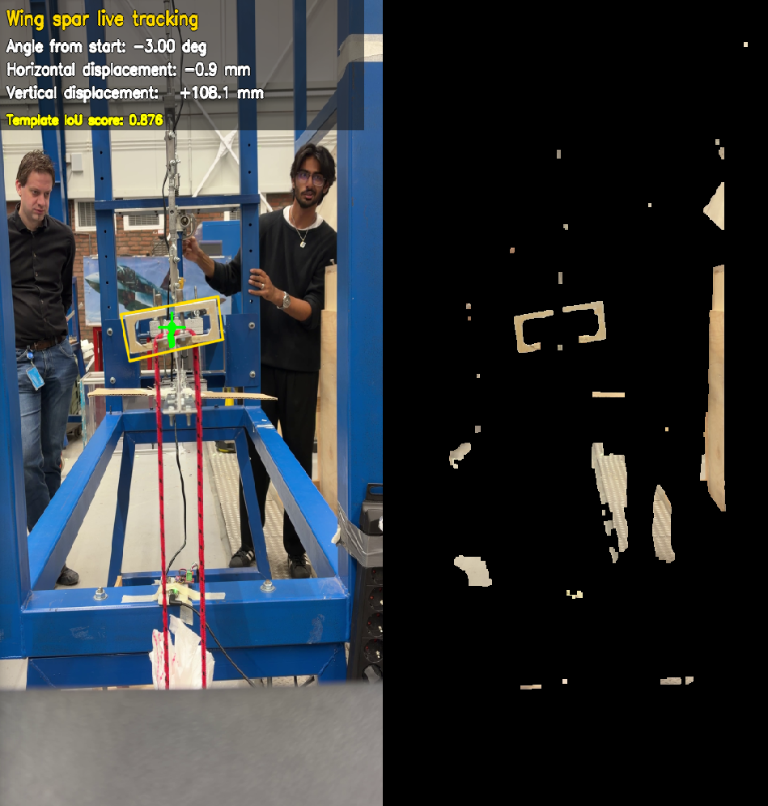

# Wing Spar Analysis - Design & Construction Final Report

Python scripts, source data, and generated figures for the final report of the first-year Design & Construction course at AE TU Delft. The analysis compares wing spar load test data with computer vision displacement and twist tracking.

## Project Contents

- `scripts/` contains the analysis and plotting scripts.
- `data/` contains the load, TOF, and extracted computer vision tracking data.
- `config/` contains saved tracker calibration and ROI setup.
- `figures/` contains generated analysis plots.
- `raw/` is for local raw video captures that should not be committed.

The raw capture video `raw/IMG_5710.mov` is intentionally ignored by git because it is about 984 MB. Keep it locally in `raw/` when running `analysis.py`, or pass another video path with `--video`.

## Setup

```bash
python -m venv .venv
.venv\Scripts\activate
pip install -r requirements.txt
```

## Run

Generate the final report figures:

```bash
python scripts/ReportFinal.py
```

Run the interactive tracker:

```bash
python scripts/analysis.py --video raw/IMG_5710.mov
```

## Report Figures

| Load over time |
| --- |
|  |

| Time-of-Flight sensor vs Computer Vision plots |
| --- |
|  |

| Computer Vision tracker overlay |
| --- |
|  |

| Time series synchronization |
| --- |
|  |

| Twist angle |
| --- |
|  |

| Noise standard deviation comparison |
| --- |
|  |

| Bias correlation |
| --- |
|  |

| TOF bias model fit |
| --- |
|  |

## Notes

Generated `.png` figures are kept in the repository so the latest analysis outputs can be viewed without rerunning the scripts. Raw video files and local Python cache files are excluded.
